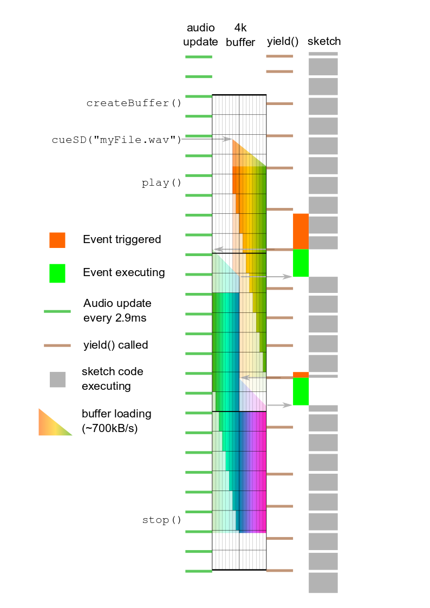

# Buffered WAV player / recorder
The `AudioPlayWAV*` and `AudioRecordWAV*` objects are intended to provide good-performance playback from and recording to WAV files stored on SD card or other filesystem, while imposing a minimal set of constraints on the sketch programmer. Multiple files may be used simultaneously.

## Objects provided
### Playback
For playback, `AudioPlayWAVstereo`, `AudioPlayWAVquad`, `AudioPlayWAVhex`, and `AudioPlayWAVoct` objects are provided. These have 2, 4, 6 and 8 outputs respectively; in order to play a mono WAV file, use either output of an `AudioPlayWAVstereo` object.
### Recording
For recording, `AudioRecordWAVmono`, `AudioRecordWAVstereo`, `AudioRecordWAVquad`, `AudioRecordWAVhex`, and `AudioRecordWAVoct` objects are provided. These have 1, 2, 4, 6 and 8 inputs respectively. Inputs which are not connected will still result in a channel being present in the stored WAV file, but it will be silent.

## Enums
### `AudioBuffer::result`
One of ``AudioBuffer::ok``, ``AudioBuffer::halfEmpty``, ``AudioBuffer::underflow``, ``AudioBuffer::full``, and ``AudioBuffer::invalid``; used to indicate the result of a function call.
### `AudioBuffer::bufType`
One of ``AudioBuffer::none``, ``AudioBuffer::given``, ``AudioBuffer::inHeap``, ``AudioBuffer::inExt``; used to define where an object's buffer memory is located. See ``createBuffer()``.

## Functions
### Buffer functions
For best results a buffer should be allocated prior to using any of these objects; if you fail to do so, a minimal 1k buffer will be allocated on the first operation, but it is unlikely to be large enough to provide stable operation.
### `AudioBuffer::result createBuffer(size_t size,AudioBuffer::bufType location)`
Creates a memory buffer of the required ``size`` in the requested ``location``. The return value will be ``AudioBuffer::ok`` if there was enough memory available to allocate the buffer, or `AudioBuffer::invalid` if memory could not be allocated, or the object was actively using the buffer to play or record when the attempt was made. 

It is highly recommended that ``size`` be a multiple of 1024. ``location`` must be one of ``AudioBuffer::inHeap`` or ``AudioBuffer::inExt``; the latter is _only_ valid if PSRAM is fitted. Buffer memory is allocated using `malloc()` or `extmem_malloc()`, so the usual precautions taken to prevent heap fragmentation should be applied in highly dynamic systems.
### `AudioBuffer::result createBuffer(uint8_t address, size_t size)`
Provides an application-controlled area of memory, located at ``address``, to the object for use as a buffer. The return value will be ``AudioBuffer::ok``, or `AudioBuffer::invalid` if the object was actively using the buffer to play or record when the attempt was made. 

It is highly recommended that ``size`` be a multiple of 1024. Use of this variant may be preferable for applications which need to create and dispose of buffers frequently, as it may help eliminate heap fragmentation.
### `AudioBuffer::result disposeBuffer()`
Signals that the object no longer requires the use of the buffer allocated by a call to ``createBuffer()``. If allocated by the ``size, location`` overload, then the memory will be freed up; if the ``address, size`` overload was used, the application may re-purpose the buffer _after_ this call has been made. Returns ``AudioBuffer::ok`` if the buffer was disposed of, or `AudioBuffer::invalid` if the object was actively using the buffer to play or record when the attempt was made.

### Operational functions
### Playback
### ``bool playSD(const char* filename [,bool paused=false [,float startFrom = 0.0]])``
### ``bool cueSD(const char* filename [,float startFrom = 0.0])``
### ``bool play(File file [,bool paused=false [,float startFrom = 0.0]])``
### ``bool cue(File file [,float startFrom = 0.0])``
Play a file from SD or another filesystem. If the optional ``paused`` parameter is provided and set to true, then playing will start in "paused" mode; the identical effect can be achieved by using the ``cue()`` variants, which are equivalent to ``play(<something>,true)``.

The optional `startFrom` parameter sets an offset into the audio data from which playback should start; the value is in milliseconds. This may be useful if you have pre-loaded the start of the file for playing directly from memory using the AudioPlayMemory object, and will play the rest from the filesystem once it has been cued up. This allows the use of large sample sets while still minimising latency and using only a single file for each sample. 

Whichever variant is used, the buffer will be pre-loaded from the filesystem during the function call, which may mean that the call takes a few milliseconds to return. If synchronisation of multiple files is important to your application, you should start them in paused mode and then resume them simultaneously - see the ``play()`` function. 

### Recording
### ``bool recordSD(const char* filename [,bool paused=false])``
### ``bool cueSD(const char* filename)``
### ``bool record(File file [,bool paused=false])``
### ``bool cue(File file)``
Record a file to SD or another filesystem. If the optional ``paused`` parameter is provided and set to true, then recording will start in "paused" mode; the identical effect can be achieved by using the ``cue()`` variants, which are equivalent to ``record(<something>,true)``.

If synchronisation of multiple files is important to your application, you should start them in paused mode and then resume them simultaneously - see the ``record()`` function. 

### Transport controls
### ``bool pause()``
Pause the operation (play or record) currently in progress. Returns true if successful.
### ``void stop()``
Stop the operation (play or record) currently in progress. 

If used on an `AudioRecordWAV*` object, the buffer will be flushed to the WAV file and the header updated with the correct length information. This can take a few milliseconds, so if synchronisation of multiple files is important to your application, you should first  pause all files, and only then stop them. 
### ``bool play()``
Resumes playing after a call to ``pause()``, or if the `AudioPlayWAV*` object was started in paused mode. Returns true if successful.
### ``bool record()``
Resumes recording after a call to ``pause()``, or if the `AudioRecordWAV*` object was started in paused mode. Returns true if successful.

### Status functions
### ``bool isPlaying()``
Returns true if an `AudioPlayWAV*` object is currently playing audio. If playback was started with ``play(<something>,true)`` then this function will _immediately_ return true, even if an audio update hasn't yet occurred in the intervening time.

### ``bool isRecording()``
Returns true if an `AudioRecordWAV*` object is currently recording audio. 

### ``bool isPaused()``
Returns true if an object is currently paused - works for both `AudioPlayWAV*` and `AudioRecordWAV*` objects. 

### ``bool isStopped()``
Returns true if an object is currently stopped - works for both `AudioPlayWAV*` and `AudioRecordWAV*` objects. 

### ``float positionMillis()``
Returns the record or playback position within the file, in milliseconds. Note that this will be incorrect by a very small amount compared to the audio actually heard, because of latency within the processing system; it should be only a matter of a few milliseconds.

### ``float lengthMillis()``
Returns the file length, in milliseconds. For playback this is straighforward. During recording, it will be some amount _smaller than_ the ``positionMillis()`` value, because there will be buffered audio awaiting writing out to the filesystem.

## Constraints
### Memory buffers
Each object _must_ have its own memory buffer to hold audio data awaiting playback or storage to the filesystem. The larger the buffer the more resilience the system will have to filesystem (or other) delays, but obviously at a penalty of reducing the memory available for other aspects of your application. If you have PSRAM fitted this can be used for buffer memory (see ``createBuffer()``).
### Yield()
Transfers between buffers and filesystem are scheduled using the EventResponder library, which is set up to execute them when the yield() function is called. The user _does not have to_ add explicit calls to `yield()`, as these will occur whenever `loop()` is allowed to return, and possibly in some (undocumented?) library functions. It is almost always good practise to allow `loop()` to return often as this allows internal "housekeeping" activities to occur; if you cannot do this, be sure to include `yield()` calls that execute sufficiently often to keep the buffers updated.
### Filesystem access
Because buffer transfers occur during `yield()`, and this is effectively part of the user's application, other filesystem operations (like reading/writing settings or log files) can be undertaken freely by the sketch.
### Timing
Filesystem access can take a significant amount of time to execute, depending on the size of the transaction, quality of the medium, filesystem fragmentation and so forth. As a result, functions like ``playSD()`` and ``stop()`` (for a recording object) can take a few milliseconds to execute, as can ``yield()`` if a filesystem transfer is triggered. Some effort has been expended to ensure that accesses are spread out in time: for example, if 4 files are being played at once, all 4 buffer reloads should not occur on the same ``yield()``, but will probably happen on 4 separate ``yield()`` calls.  

## Examples
These can be found in Examples/Audio/Buffered
### Recorder
This is a variant on the Recorder example, but using the buffered objects to record and play a _stereo WAV_ file, rather than a queue and application-based writes to record a _mono RAW_ file, plus the ``AudioPlaySdRaw`` object for playback. As written it uses 128k of heap for the buffers. You will need an audio adaptor and a source of audio connected to the line inputs for this one. A couple of ``AudioAnalyzePeak`` objects are used to provide a crude level meter to allow you to set up prior to recording.
### RecSynthMusic
This is based on the PlaySynthMusic example. It plays a short piece of music using a very simple 16-voice polyphonic synth, while simultaneously recording it to three WAV files with 4, 6 and 8 tracks - the last track of the 6- and 8-track files is unconnected and hence silent. It then re-patches the audio connections and plays the files back, which should sound identical to the original.

## Under the hood
The following graphic describes what's going on under the hood, and when, during playback of a WAV file. Time runs from top to bottom; green bars show the regular 2.9ms audio update; brown bars at irregular intervals show when calls to yield() occur; grey blocks show when your sketch code is running. Not particularly to scale - for a start a 700kB/s filesystem would be a bit on the slow side...

- the sketch creates a 4k buffer
- the file `myFile.wav` is cued up ready to play:
  - at least half the buffer is pre-loaded with audio data, which causes a few milliseconds' delay
  - different objects will pre-load different amounts, to try to stagger the re-load times
- another audio update occurs while playback is still paused
- `play()` requests that playback is started
  - audio output will start at the next audio update
- after two audio updates 
  - the first half of the buffer is empty
  - an event is triggered to EventResponder, requesting a buffer load
- the sketch gets around to calling `yield()` 
  - this starts the buffer load via EventResponder
  - the sketch code is _not_ executing during the load
  - by the time the load is complete, 3 audio updates have occurred since it was requested
- the next buffer load is faster, because yield() is called sooner after the trigger
- `stop()` is called before the file is completely played 
  - playing stops and the buffer contents are invalidated on the next audio update
   
Recording is very similar, except that:
- data is being written to the file, not read from it
- a "flush" delay occurs _after_ `stop()` is called, rather than a pre-load delay
