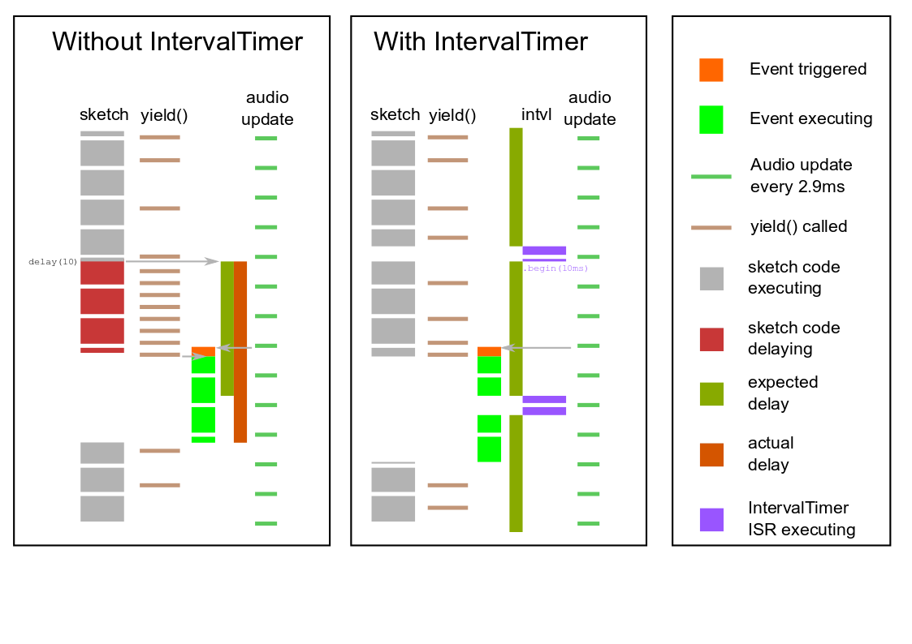

# Interval-timed audio sketch

## Why?
Because delay() is a _really poor_ way of getting accurate timing, and making loop() exit and using millis() to work out when to do things is not a whole lot better.
## But why?
Because if you've set up an EventResponder that triggers on `yield()`, your delays may be longer than the expected length:

### Without IntervalTimer
 - Your sketch gets to a point where the next thing to do is after 10ms
 - So you put in `delay(10)`
 - All is going well for 7ms, then the audio update requests a filesystem write
 - Because `delay()` calls `yield()` every millisecond, the filesystem access starts...
 - ... but the access itself takes 9ms, so the `delay(10)` actually ends up taking 16ms before control returns to your sketch
  
 ### With IntervalTimer
- All your timing-critical code is in an IntervalTimer ISR (Interrupt Service Routine)
- When the next thing to do is after 10ms, the ISR sets up its IntervalTimer to trigger after 10ms, and returns
- 7ms later (as before), the audio update requests a filesystem write, a `yield()` triggers it, and it starts; but...
- ...3ms later, the IntervalTimer triggers, interrupting the filesystem access
- As before, when the next thing to do is after a while, the IntervalTimer trigger is set up, and the ISR returns...
- ... to the filesystem access, which continues until complete
- and _finally_ your sketch can run again!
 
## Stuff to note
- Ideally your IntervalTimer ISR should run at a _lower_ interrupt priority than the audio update
- This is hard to guarantee, as 4 IntervalTimers are available, and any library code that uses one _might_ change the priority level that's shared by all of them
- See the example for a way of using an artbitrary-priority IntervalTimer to trigger a "private" low-priority ISR
